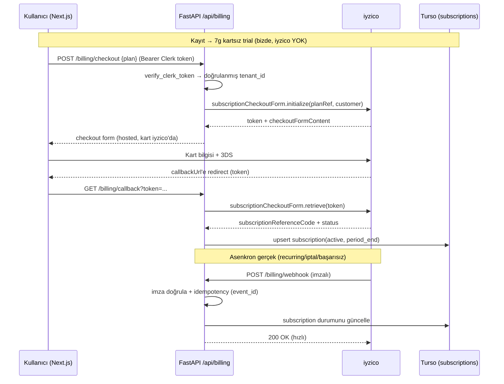

# iyzico Ödeme Entegrasyon Planı (Teknik)

> **Durum:** taslak · 2026-07-15
> **Kapsam:** Bu belge **teknik entegrasyon** planıdır. İş modeli, fiyat, değer çiti
> ve paketleme kararları [`MONETIZATION_PLAN.md`](./MONETIZATION_PLAN.md)'de; burada
> onları **tekrar etmiyoruz**, yalnızca iyzico'ya nasıl bağlanacağını anlatıyoruz.
> Mimari genel bakış: [`TEKNIK_MIMARI.md`](./TEKNIK_MIMARI.md).
> **Çıkış kapısı:** sandbox'ta uçtan uca abonelik + webhook + kota enforcement +
> ilk gerçek (prod) ödeme.

---

## 0. Yönetici özeti

- Stack uyumlu; iyzico entegrasyonu **additive** (mevcut kod dokunulmadan yeni
  router + store + tek `entitlements` bağı).
- **Ödeme öncesi 2 mimari ön koşul ZORUNLU** (aşağıda §1). Bunlar iyzico'ya özel
  değil — para güvenliği. Atlanırsa entegrasyon çalışır ama **gelir sızdırır**.
- iyzico **Abonelik (Subscription) API** kullanılır (recurring + dunning/retry;
  SOSA %32 istemsiz churn'e karşı kritik).
- **7 gün kartsız reverse trial** iyzico'da DEĞİL, **bizde** tutulur; iyzico yalnız
  dönüşümde (kart girilince) devreye girer.
- Kart verisi bize hiç değmez → **hosted Checkout Form** → PCI-DSS yükü yok.

---

## 1. Ön koşullar (ödemeden ÖNCE, sırayla)

### 🔴 P0 — Sunucu-tarafı kimlik doğrulama
Bugün backend `X-Tenant-Id`'yi (Clerk userId) **doğrulamadan** güveniyor
(`app/security.py`). Premium'u `tenant_id`'ye bağladığımız an, kullanıcı header'ı
değiştirip bedava premium olur. **Ödeme geldiğinde kabul edilemez.**

**Yapılacak:** Ödeme/entitlement kararı veren uçlarda Clerk oturum token'ı
sunucu-tarafı doğrulanmalı.
- Frontend `Authorization: Bearer <Clerk session token>` gönderir (Clerk
  `getToken()`).
- Backend'de `verify_clerk_token` dependency (Clerk JWKS ile JWT doğrula) → `sub`
  claim'inden **doğrulanmış** `tenant_id` çıkar.
- Bağlanacak uçlar: `billing/*`, `me/*` ve **kota/entitlement uygulayan** generate
  uçları. Anonim (girişsiz) üretim doğrulamasız kalır (SEO motoru bozulmasın).
- Not: `python-jose[cryptography]` veya `pyjwt[crypto]` + Clerk JWKS endpoint.

### 🔴 P0 — Kalıcı veritabanı (Turso zorunlu)
Render free tier kalıcı disk vermez → restart'ta `history.sqlite3` sıfırlanır.
**Abonelik durumu kaybedilemez.**
- `TURSO_DATABASE_URL` + `TURSO_AUTH_TOKEN` prod'da **set edilir** (kod hazır,
  `db_connection.py` otomatik libSQL'e geçer).
- Yeni billing tabloları Turso'da yaşar; `readyz` `db_backend == "turso"` doğrular.

### 🟠 P1 — Webhook güvenilirliği (cold start)
Free-tier suspend + ~60sn cold start → webhook uyuyan container'a düşebilir.
- Zaten var: keepalive cron (`*/5`) + UptimeRobot + `BackendWarmup`.
- Eklenecek: webhook **imza doğrulama** + **idempotent işleme** + hızlı 200 ack.
- iyzico başarısız bildirimde retry yapar; idempotency + retry-tolerans yeterli.

---

## 2. iyzico ürün seçimi

| iyzico ürünü | Kullanım |
|---|---|
| **Abonelik (Subscription) API** | ✅ Ana yol — recurring Bireysel/Sınıf planları, otomatik yenileme + dunning. |
| **Checkout Form (CF)** | Abonelik başlatma ekranı (kart toplama, hosted). |
| Ödeme (tek çekim) | Opsiyonel — Kurumsal/tek seferlik faturalı satış için. Faz 2. |

**Abonelik modeli hiyerarşisi (iyzico):**
```
Abonelik Ürünü (Subscription Product)   ← "Soru Atölyesi Pro"
   └── Ödeme Planı (Pricing Plan)        ← her SKU: bireysel-aylik, bireysel-yillik,
                                             sinif-aylik, sinif-yillik ...
          └── Abonelik (Subscription)    ← kullanıcı × plan (referenceCode ile izlenir)
```
Fiyat/interval iyzico Pricing Plan'de tanımlanır. Netleşen SKU'lar (2026-07-16,
MONETIZATION_PLAN §6): `pro-aylik` (₺189/ay KDV dahil) ve `pro-plus-aylik`
(₺249/ay KDV dahil) → her biri bir iyzico pricing plan'ine map'lenir. Ücretsiz
kademe (100 soru/ay) + 7g reverse trial **iyzico'da DEĞİL, bizde** tutulur.
Kurumsal → "teklif" (manuel/Faz 2). ⚠️ Canlı `frontend/app/pricing/page.tsx` hâlâ
eski yapıyı (Bireysel ₺99 / Sınıf ₺249 / Kurumsal) gösteriyor → billing frontend
işinde bu tabloya göre güncellenecek.

> ⚠️ iyzico API alan adları ve imza başlığı sürümle değişebilir — **kesin isimler
> için `docs.iyzico.com` (Abonelik + Bildirim/Webhook) doğrulanmalı.** Bu plan
> akışı ve sözleşmeyi tanımlar, birebir field şemasını değil.

---

## 3. Mimari akış



**İlke:** subscription'ın **kaynak-of-truth'u DB'deki satır**, webhook ile
senkronlanır. `entitlements.is_premium()` yalnız bu satıra bakar — client'a asla.

---

## 4. Veri modeli (yeni store: `app/services/billing_store.py`)

Turso/libSQL üzerinde iki tablo:

```sql
-- Abonelik durumu (source of truth)
CREATE TABLE IF NOT EXISTS subscriptions (
  tenant_id          TEXT PRIMARY KEY,      -- doğrulanmış Clerk userId
  plan_code          TEXT NOT NULL,         -- bireysel-aylik | sinif-yillik | ...
  status             TEXT NOT NULL,         -- trialing | active | past_due | canceled | expired
  provider           TEXT NOT NULL DEFAULT 'iyzico',
  provider_ref       TEXT,                  -- iyzico subscriptionReferenceCode
  customer_ref       TEXT,                  -- iyzico customerReferenceCode
  trial_end          TEXT,                  -- ISO; kartsız trial bitişi
  current_period_end TEXT,                  -- ISO; erişim bu tarihe kadar
  cancel_at_period_end INTEGER DEFAULT 0,
  created_at         TEXT NOT NULL,
  updated_at         TEXT NOT NULL
);

-- Webhook idempotency + audit
CREATE TABLE IF NOT EXISTS billing_events (
  event_id     TEXT PRIMARY KEY,           -- iyzico event/notification id
  event_type   TEXT NOT NULL,
  tenant_id    TEXT,
  payload_json TEXT NOT NULL,
  received_at  TEXT NOT NULL,
  processed    INTEGER DEFAULT 0
);
```

`db_connection.connect()` kullanılır (diğer store'larla aynı desen; Turso otomatik).

---

## 5. Backend değişiklikleri

### 5.1 Yeni router — `app/routers/billing.py` (prefix `/api/billing`)
| Uç | Amaç |
|---|---|
| `GET /plans` | Aktif planlar + fiyat (frontend fiyat sayfasını besler) |
| `POST /checkout` | iyzico subscription checkout form başlat → token/URL döner (Clerk token zorunlu) |
| `GET /callback` | iyzico dönüşü — token ile `retrieve`, sub satırını upsert, `/practice`'e redirect |
| `POST /webhook` | iyzico bildirimleri — **imza doğrula + idempotent** |
| `GET /subscription` | Kullanıcının mevcut abonelik durumu (UI için) |
| `POST /cancel` | Dönem sonu iptal (`cancel_at_period_end=1` + iyzico cancel) |

### 5.2 Yeni servis — `app/services/iyzico_client.py`
- `iyzipay` SDK sarmalayıcı; `sandbox|prod` base URL config'ten.
- Fonksiyonlar: `init_subscription_checkout`, `retrieve_checkout`, `cancel_subscription`,
  `upgrade_subscription`, `verify_webhook_signature`.
- Tüm sırlar env'den; log'a kart/PII yazma.

### 5.3 `entitlements.py` — tek satır bağ (blast radius minimum)
```python
def is_premium(tenant_id: str | None) -> bool:
    if not tenant_id:
        return False
    # ÖNCE billing_store'a bak (kaynak of truth); config allowlist yalnız fallback/dev
    sub = billing_store.get_active(tenant_id)   # trialing|active + period_end > now
    if sub:
        return True
    if settings.premium_all:            # dev/demo — canlıda False'a çekilecek
        return True
    return tenant_id in settings.premium_tenant_id_set
```
Ayrıca `plan_code`'a göre özellik ayrımı için `entitlements.plan_of(tenant_id)`
(kota tavanı, white-label, çoklu sınıf gibi kademe farkları buradan okunur).

### 5.4 Kota enforcement
- `USAGE_LEDGER` zaten üretim başına tenant kaydı tutuyor → aylık sayaç ondan.
- Generate uçlarında (`worksheets.py`, `quizzes.py`) üretimden **önce**:
  `entitlements.check_quota(tenant_id)` → aşımda **HTTP 402** + paywall sinyali.
- Cache-hit üretimler kotadan **düşmez** (fiyat sayfasında verilen söz —
  `pricing/page.tsx:196`).
- Anonim üretim kotasızdır (SEO); kota yalnız giriş yapmış tenant'a.

### 5.5 Config (`app/config.py`) — yeni ayarlar
```
IYZICO_API_KEY / IYZICO_SECRET_KEY          (sync:false — sır)
IYZICO_BASE_URL   = https://sandbox-api.iyzipay.com | https://api.iyzipay.com
IYZICO_WEBHOOK_SECRET                        (imza doğrulama)
BILLING_ENABLED   = false                    (feature flag — kademeli açılış)
premium_all       → prod'da FALSE            (billing canlı olunca)
```
`render.yaml`'a `sync:false` env'ler eklenir (dashboard'dan girilir).

---

## 6. Reverse trial (7 gün, kartsız) — bizde tutulur

iyzico aboneliği **kart ister**; kartsız 7 günü iyzico veremez. Bu yüzden:
1. Kullanıcı ilk giriş/onboarding → `subscriptions` satırı `status=trialing`,
   `trial_end = now+7g` (iyzico çağrısı YOK).
2. `is_premium()` `trialing` + `trial_end>now` iken True → tam Pro deneyim.
3. Trial biterken paywall (kayıp-kaçınma; SOSA reverse-trial %0.4→%4.5).
4. Kullanıcı ödemeye karar verince → §3 checkout akışı → iyzico subscription başlar,
   satır `active`'e döner. Kart yoksa `trial_end` geçince `is_premium()` False.

Trial bitiş kontrolü lazy (istek anında `trial_end` karşılaştır) — cron gerekmez.

---

## 7. Webhook işleme (kritik detaylar)

- **İmza:** iyzico bildirim imzasını ham body + `IYZICO_WEBHOOK_SECRET` ile doğrula
  (HmacSHA256; başlık adı iyzico sürümüne göre — docs'tan teyit). Geçersiz → 401.
- **Idempotency:** `billing_events.event_id` PRIMARY KEY; daha önce işlendiyse
  no-op + 200. (iyzico retry'larına dayanıklı.)
- **Hızlı ack:** önce event'i `billing_events`'e yaz + 200 dön; ağır iş minimal.
- **İşlenen olaylar** (iyzico event tipleri docs'tan teyit): abonelik başladı,
  yenileme başarılı → `current_period_end` uzat; ödeme başarısız → `past_due`
  (dunning); iptal → `cancel_at_period_end`/`canceled`; süresi doldu → `expired`.
- **Skew koruması:** callback (senkron) ve webhook (asenkron) ikisi de satırı
  upsert eder; `updated_at`/durum önceliğiyle son-yazan tutarlı olsun.

---

## 8. Frontend değişiklikleri

- `frontend/app/pricing/page.tsx`: `cta:"interest"` (mailto) → **gerçek checkout**.
  `BILLING_ENABLED` kapalıyken mevcut "ilgileniyorum" davranışı korunur (güvenli
  kademeli açılış).
- `lib/api.ts`: `createCheckout(plan)`, `getSubscription()`, `cancelSubscription()`;
  hepsinde `Authorization: Bearer <Clerk getToken()>`.
- Checkout: iyzico hosted form'a redirect (veya `checkoutFormContent` script embed).
- Dönüş sayfası: `/practice/billing/return` — başarı/başarısız durumu + abonelik özeti.
- **Paywall bileşeni**: kota dolunca/trial bitince (jarring değil, güven-önce):
  fiyat vurgusu, "aylık ₺X gibi" yıllık çerçeve, "istediğin an iptal", sosyal kanıt.
- Abonelik yönetimi kartı: `/practice` → plan, yenileme tarihi, iptal butonu.

---

## 9. Fatura & legal (TR — kod dışı ama bloklayıcı)

- **Mesafeli satış sözleşmesi** + **ön bilgilendirme formu** (checkout öncesi onay).
- **e-Arşiv fatura** (KDV %20 dijital hizmet) — iyzico fatura üretmez; muhasebe/
  e-arşiv entegratörü (ör. Paraşüt/Logo) ya da manuel. Satış → fatura tetikleyici.
- **İptal/iade** akışı + KVKK (opt-in ve `/legal/*` zaten var, doldurulacak).
- iyzico başvuru/onay süreci (işletme doğrulama) lansmandan önce tamamlanmalı.

---

## 10. Test (sandbox)

- iyzico **sandbox** (`sandbox-api.iyzipay.com`) + test kartları (3DS başarılı/başarısız).
- Senaryolar: başarılı abonelik, 3DS iptal, yenileme başarılı, yenileme başarısız
  (past_due→dunning), kullanıcı iptali, trial→paid, trial→expire.
- Webhook: sandbox bildirimlerini yerel/preview'a tünelle (ör. ngrok) veya Render
  preview env; imza + idempotency test et (aynı event iki kez → tek işleme).
- pytest: `billing_store` CRUD + `entitlements.is_premium/check_quota` birim testleri
  (CI eval'ın "Unit tests" doğrudan koştuğunu unutma — `python tests/test_billing.py`).

---

## 11. Kademeli açılış (rollout)

1. **P0'lar** (kimlik doğrulama + Turso) → merge, prod'da doğrula (`readyz` turso).
2. `BILLING_ENABLED=false` iken tüm kod merge (dark launch); UI eski davranış.
3. Sandbox uçtan uca yeşil.
4. iyzico prod onayı + legal metinler canlı.
5. `premium_all=false` + `BILLING_ENABLED=true` + iyzico prod key → **birkaç
   allowlist tenant** ile canary; ilk gerçek ödeme.
6. Herkese aç; GA4 funnel (checkout_start → subscription_active) + istemsiz churn izle.
7. **Geri kapatma:** `BILLING_ENABLED=false` (UI mailto'ya döner) + `premium_all=true`
   (kimse kilitlenmez). Additive olduğu için düşük risk.

---

## 12. İş kalemleri (özet checklist)

- [x] **P0:** `verify_clerk_token` dependency + Clerk JWKS (backend JWT doğrulama) —
      PR #93 (`clerk_auth.py`: primitif + spoof koruması) + PR #94 (`me/*` wiring +
      frontend Bearer token). Additive: `CLERK_ISSUER` boşken kapalı; aktivasyon için
      set edilecek. Follow-up: `worksheets.py` history + generate entitlement wiring.
- [ ] **P0:** Turso prod env set + `readyz` doğrula
- [ ] `billing_store.py` (+ 2 tablo) + birim testleri
- [ ] `iyzico_client.py` (SDK sarmalayıcı, sandbox)
- [ ] `routers/billing.py` (checkout / callback / webhook / subscription / cancel)
- [ ] Webhook imza + idempotency + hızlı ack
- [ ] `entitlements.is_premium/plan_of/check_quota` → billing_store bağı
- [ ] Kota enforcement generate uçlarında (402 + paywall sinyali)
- [ ] iyzico Abonelik Ürünü + Pricing Plan'ler (sandbox → prod)
- [ ] Frontend: checkout akışı, paywall, abonelik yönetimi, dönüş sayfası
- [ ] Config + `render.yaml` env'ler + `BILLING_ENABLED` flag
- [ ] Legal: mesafeli satış + ön bilgilendirme + e-arşiv fatura akışı
- [ ] Sandbox e2e senaryolar → canary → go-live

---

## 13. Riskler & kararlar

| Risk | Önlem |
|---|---|
| Kimlik spoof → bedava premium | P0 JWT doğrulama (bloklayıcı) |
| Restart'ta abonelik kaybı | P0 Turso (bloklayıcı) |
| Webhook cold-start'ta düşer | keepalive + iyzico retry + idempotency |
| Çift işleme (retry) | `billing_events.event_id` PK |
| callback/webhook yarışı | upsert + durum önceliği |
| iyzico API alan/sürüm farkı | `docs.iyzico.com`'dan teyit; client tek dosyada izole |
| Freemium erişimi baltalama | anonim üretim + ücretsiz kademe kotalı kalır ([[MONETIZATION_PLAN]]) |

**Kararlar (✅ KAPANDI 2026-07-16 — bkz. MONETIZATION_PLAN §6):**
1. **SKU seti:** iki Pro kademesi — `pro-aylik` (₺189/ay, 1000 soru/ay) +
   `pro-plus-aylik` (₺249/ay, fair-use sınırsız + tam veli/öğretmen analitiği).
   Ücretsiz 100 soru/ay kalıcı + 7g kartsız reverse trial. Lansmanda yalnız aylık.
2. **Kurumsal:** Faz 2 — manuel/teklif (self-serve değil).
3. **e-Arşiv fatura:** başta manuel (GİB/SMMM); fiyatlar KDV dahil.
4. **Kota:** birim = soru/ay, aylık reset, cache-hit sayılmaz, anonim üretim kotasız.
