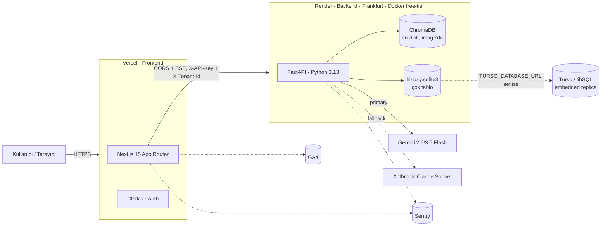
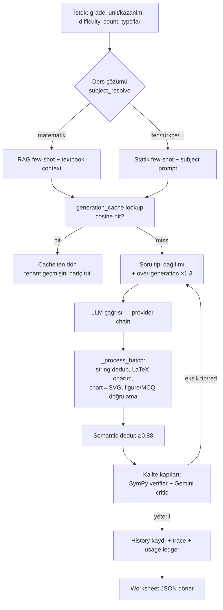

# Soru Atölyesi — Teknik Mimari & Dokümantasyon

> **Durum:** 2026-07-15 · Bu belge kod tabanının o günkü halinden türetilmiştir.
> Kısa README özeti eskidir (1-7. sınıf yalnız matematik der); gerçek sistem
> **1-8. sınıf + LGS**, **5 ders** (Matematik, Fen, Türkçe, Sosyal, İngilizce),
> rol tabanlı öğrenme platformu ve programatik SEO ağacını kapsar.

---

## 1. Genel Bakış

Soru Atölyesi, MEB müfredatına hizalı **soru/çalışma kağıdı/quiz üreten** bir
LLM uygulamasıdır. İki ürün yüzeyi vardır:

1. **Üretim yüzeyi** (`/generate`) — herkese açık, üyeliksiz PDF çalışma kağıdı
   üretimi (PDF indirme kayıt kapısında).
2. **Öğrenme yüzeyi** (`/practice`) — üyelik gerektiren; çöz-puanla-ilerle,
   ödev/sınıf, veli takibi, çalışma planı, oyunlaştırma.

Ayrıca büyük bir **programatik SEO ağacı** (`/calismalar`, sınıf hub'ları,
`/lgs-matematik`) ve triple-gate korumalı bir **admin paneli** vardır.

### Yüksek seviyeli topoloji



### Teknoloji stack özeti

| Katman | Teknoloji |
|---|---|
| **Backend** | Python 3.13, FastAPI (≥0.115), Pydantic 2 + pydantic-settings, slowapi (rate limit), uvicorn |
| **LLM** | Gemini 2.5 Flash / 3.5 Flash (primary, `google-genai`), Anthropic Claude Sonnet (opsiyonel fallback) |
| **Embedding** | `gemini-embedding-001`, 768 boyut |
| **Vector DB** | ChromaDB (≥1.5) on-disk, image'a COPY; hybrid BM25 (`rank-bm25`) + vektör RRF füzyon |
| **Kalıcılık** | Tek SQLite dosyası (`history.sqlite3`) çok tabloyla; opsiyonel Turso/libSQL embedded replica (`libsql-experimental`) |
| **Matematik doğrulama** | SymPy (deterministik aritmetik kontrol) |
| **PDF / render** | ReportLab (≥4), svglib (≥1.5,<1.6), matplotlib mathtext (LaTeX→PNG), lxml |
| **Frontend** | Next.js 15 (App Router), React 18, TypeScript 5, Tailwind, shadcn/ui (Radix) |
| **Auth** | Clerk v7 (`@clerk/nextjs`), `trTR` lokalizasyon, rol=metadata |
| **Render katmanı (FE)** | react-markdown, remark-gfm, remark-math, rehype-katex, katex, isomorphic-dompurify |
| **State / form** | Zustand (persist), react-hook-form + zod |
| **Hosting** | Render (backend, Docker, Frankfurt), Vercel (frontend) |
| **Gözlemlenebilirlik** | Sentry (BE+FE), GA4 (consent-gated) |
| **CI** | GitHub Actions: `frontend-ci` (lint+typecheck), `eval` (quick/full), `keepalive` (cron ping) |

---

## 2. Backend Mimarisi (`app/`)

FastAPI mikroservisi; ~85 Python modülü. Giriş noktası `app/main.py`.

### 2.1 Uygulama kurulumu — `app/main.py`

- **Sentry**: import anında `_init_sentry()` (yalnız `SENTRY_DSN` varsa; fail-safe).
- **CORS**: `CORSMiddleware`, `allow_origins = settings.cors_origin_list`
  (boşsa `["*"]`), `allow_credentials=True`.
- **Rate limiting**: slowapi — `app.state.limiter` + `SlowAPIMiddleware`;
  uç nokta başına `@limiter.limit(...)`. Kimlik = `X-Tenant-Id` (Clerk userId)
  veya IP. `RateLimitExceeded` → HTTP 429 (Türkçe mesaj).
- **Lifespan yok**: store'lar (singleton) ilk import'ta kendi tablolarını lazy oluşturur.
- **Router'lar**: `curriculum`, `worksheets`, `quizzes`, `shared`, `classrooms`,
  `assignments`, `me` (`/api/*` altında), `admin` (`/admin`), `health`.

**Health uçları:**
| Uç | Amaç |
|---|---|
| `GET/HEAD /health`, `/healthz` | Liveness `{"status":"ok"}` |
| `GET /readyz` | Readiness: gemini key + DB backend (turso/local) + worksheet history satırı + chroma count; gemini key yok **veya** chroma boşsa 503 |

### 2.2 Router'lar (`app/routers/`)

| Router | Prefix | Öne çıkan uçlar |
|---|---|---|
| `curriculum.py` | `/api/curriculum` | `grades`, `grades/{id}/topics`, `.../kazanimlar`, `grades/{id}/units`, `units/{id}/kazanimlar`. `_require_enabled(subject)` matematik dışını flag'le kapılar (403). |
| `worksheets.py` | `/api/worksheets` | `POST generate`, `generate.pdf`, `generate.stream` (SSE), `render.pdf` (LLM'siz, white-label), `regenerate-question`, `GET/DELETE history`. Çekirdek motor `_build_worksheet()`. |
| `quizzes.py` | `/api/quizzes` | `POST ""` (çözülebilir quiz üret, cevapsız döner), `GET /{id}`, `POST /{id}/attempt` (sunucu-tarafı puanlama), `POST /{id}/share`. |
| `shared.py` | `/api/shared` | `GET /{code}` (üyeliksiz), `POST /{code}/attempt` (per-IP rate-limit). Viral giriş noktası. |
| `classrooms.py` | `/api/classrooms` | Sınıf oluştur/katıl (kod ile), ödev ata (quiz veya PDF). |
| `assignments.py` | `/api/assignments` | Ödev çözme + sonuç panosu (üyelik `_resolve_assignment` ile zorlanır). |
| `me.py` | `/api/me` | `progress`, `study-plan`, `parent-code`/`link-child`/`children`, `gamification`, `attempts`, `shares`, `quizzes`, `assignments`, `email-prefs`. |
| `admin.py` | `/admin` | `costs/summary`, `cache/stats`, `cache/recent`, `history/*`, `worksheet-history/*`, `audit`. `require_admin_key` (`X-Admin-Key`) + her çağrı `ADMIN_AUDIT`'e loglanır. |

> **Not — roller sunucuda örtük:** Ayrı bir roller/onboarding router'ı **yoktur**.
> Öğretmen = sınıf sahibi, öğrenci = üye/çözen, veli = parent-link sahibi.
> Rol UI'ı ve zorlaması frontend/Clerk tarafındadır.

### 2.3 Üretim hattı (generation pipeline)

Çekirdek orkestratör: **`app/services/agent.py`** (`GeminiAgent.generate()`).
Bir üretim isteğinin izlediği yol:



**Latency optimizasyonları:**
- `difficulty_mode` = `mixed`/`progressive` → kolay/orta/zor kovalarına bölünüp
  **`ThreadPoolExecutor` ile paralel** üretilir (her kova izole `GeminiAgent`,
  trace-state yarışını önlemek için).
- **Over-generation** (`generation_overshoot_ratio=1.3`) → red sonrası yeniden
  istek gerekmez.
- **Generation cache** (ChromaDB/SQLite) → aynı parametre kombinasyonu tekrar döner.
- **`_CHROMA_LOCK` (RLock)** → ChromaDB thread-safe değil; paralel kovalar altında
  tüm Chroma erişimi serileştirilir.

### 2.4 Multi-LLM fallback zinciri — `app/services/llm_providers.py`

```
Gemini (primary) → Gemini fallback'ler (flash-lite, pro) → Anthropic Claude Sonnet
```

- `GeminiProvider`: native `response_schema` (Pydantic) ile yapısal çıktı.
- `AnthropicProvider`: `tool_use` ile yapısal çıktı.
- `call_with_chain()`: `ProviderTransientError` (429/5xx) → exponential backoff +
  bir sonraki modele geç; `ProviderError` → modeli atla. Model başına 3 retry.
- `PRICING_USD_PER_1M_TOKENS` maliyet tablosu → `TokenUsage.estimated_cost_usd`
  (admin maliyet panosunu besler).
- Model seçimi: `model_for_grade()` — 1-4. sınıf → Gemini 2.5 Flash, 5-8 → 3.5 Flash.

### 2.5 RAG / retrieval

- **`retriever.py`**: ChromaDB retrieval, `_CHROMA_LOCK` ile korunur. Fallback
  zinciri `(grade, kazanim_kod, difficulty)` → `(grade, kazanim_kod)` →
  `(grade, topic_id)`. **Hybrid**: BM25 (`rank-bm25`) + vektör, RRF füzyon
  (`hybrid_bm25_weight=0.3`, `hybrid_rrf_k=60`). `retrieve()` few-shot için,
  `retrieve_textbook()` MEB ders kitabı chunk'ları için (yalnız matematik).
  Source-aware: aynı PDF'ten max 2 chunk.
- **`embedder.py`**: `GeminiEmbedder` (`gemini-embedding-001`, 768d).
- **`diversity.py`**: soru tipi dağılımı + batch-içi dedup + MMR çeşitli seçim.

### 2.6 Kalite kapıları

| Modül | İş |
|---|---|
| `math_verifier.py` | SymPy ile SALT_ISLEM/ISLEM aritmetik doğrulama (fail-open). |
| `critic.py` | LLM judge (`gemini-2.5-flash-lite`): doğruluk/tutarlılık/kazanım-uyum/zorluk skoru; `critic_min_confidence=0.6` kapısı (fail-open). |
| `structured.py` | 4 çözülebilir tip için alan türetme + doğrulama. |
| Dedup | String (agent içi `BatchDeduplicator`) + semantic (`SemanticDeduplicator`, eşik 0.88). |

### 2.7 Persistence & store'lar

Tek dosya **`history.sqlite3`** (opsiyonel Turso embedded replica ile aynalı).
`db_connection.py` → `connect()`: `TURSO_DATABASE_URL` set ise libSQL
(`_SyncOnCommit` wrapper, commit'te sync), değilse `sqlite3`.

| Store | Tablo(lar) |
|---|---|
| `llm_cache.py` | `generation_cache` |
| `history.py` | `history` (tekrar önleme) |
| `worksheet_history.py` | `worksheet_history` (tenant başına FIFO trim) |
| `usage_ledger.py` | `usage_ledger` (üretim başına gerçek Gemini maliyeti) |
| `quiz_store.py` | `quizzes`, `attempts`, `shares`, `mastery_state` |
| `classroom_store.py` | `classrooms`, `members`, `assignments`, `results` |
| `parent_link_store.py` | veli↔öğrenci bağları |
| `email_prefs_store.py` | KVKK opt-in tercihleri |
| `study_plan_store.py` | tenant başına haftalık plan |
| `admin_audit.py` | `admin_audit` (admin erişim logu) |

### 2.8 Ders eklenti sistemi — `app/subjects/`

Kayıt (`__init__.py`): `SUBJECTS` (5 ders), `SUBJECT_FLAGS` (ders→Settings flag),
`_CONTENT` (matematik dışı içerik modülleri).

- `base.py` — `SubjectPlugin` (frozen dataclass): `id`, `display_name`, `slug`
  (route + ChromaDB metadata key), `grades`, `enabled`.
- `matematik.py` — klasik hat (RAG + textbook + SymPy). İçerik modülü yok.
- `fen/`, `turkce/`, `sosyal/`, `ingilizce/` — her biri **tek tip içerik arayüzü**:
  `curriculum.py` (üniteler+kazanımlar), `prompt.py` (`SYSTEM_PROMPT`,
  `YENI_NESIL_BLOCK`), `critic.py`, `few_shot.py` (statik gerçek MEB/LGS örnekleri,
  RAG yok), `select_kazanimlar()`, `collect_few_shot()`, `DEFAULT_TYPES`.

`agent.generate()` `is_math` üzerinde dallanır: matematik RAG/textbook/verifier
kullanır; diğer dersler subject prompt + statik few-shot + ünite-bazlı seçim.
**Yeni ders eklemek** = tek tip arayüzlü yeni paket + `SUBJECTS`/`SUBJECT_FLAGS`/
`_CONTENT`'e kayıt.

### 2.9 Müfredat verisi — `app/data/`

İki paralel içerik sistemi (köprü: `legacy_topic_id`):
- **Legacy** — `curriculum.py` (99KB): 1-7. sınıf, 5 öğrenme alanı, kod `M.{g}.{a}.{n}`.
- **Güncel** — `units.py` + `units.json` (123KB): MEB TYMM ünite katmanı
  (sınıf→ünite→kazanım), kod `MAT.{g}.{tema}.{n}`. `scripts/build_units.py` ile
  tymm.meb.gov.tr'den türetilir.
- `few_shot/` — sınıf başına statik matematik few-shot havuzu (RAG kapalı/fail ise).

### 2.10 Ders çözümü (migrasyonsuz subject) — `app/services/subject_resolve.py`

Ders DB'de **saklanmaz**; `kazanim_kod` prefix'inden çözülür
(`M./MAT.`=matematik, `FB./F.`=fen, `T.`=türkçe, `SB.`=sosyal, `E#`=ingilizce)
→ subject + okunabilir konu + sınıf. Bu sayede çok-ders eklenirken migrasyon
gerekmedi, matematik verisi dokunulmadı.

---

## 3. Frontend Mimarisi (`frontend/`)

Next.js 15 App Router (paket adı `sheetgen-frontend`, prod domain `soruatolyesi.com`).

### 3.1 Kök layout & sağlayıcılar

`app/layout.tsx`: `ClerkProvider` (`trTR`) → `ThemeProvider` → `TopNavBar` +
`<main>` + `Toaster` + `RoleGate` + `CookieConsent` + `Analytics` + `BackendWarmup`.
KaTeX CSS global import.

### 3.2 Rotalar

| Rota | Açıklama |
|---|---|
| `/` | Landing (hero, ders vitrini, sınıf hub'ları, FAQ). `hasMultipleSubjects()`'e göre dallanır. |
| `/generate` | **Public** üretim formu + preview; PDF indirme `SignUpButton` kapısında. |
| `/practice` | Rol-bazlı `PracticeHub`; `.practice-theme` layout. Alt: `new`, `quiz/[id]`, `history`, `progress`, `study-plan`, `shares`, `classes`, `assignments`. |
| `/history` | Backend-kalıcı çalışma kağıdı geçmişi (üyelik). |
| `/q/[code]` | Üyeliksiz paylaşılan quiz çözücü (viral). |
| `/admin/*` | Dashboard, tenants, cache, audit. `isAdminUser()` yoksa `notFound()`. |
| `/calismalar`, `/calismalar/[slug]`, `/calismalar/[slug]/[kazanim]` | Programatik SEO ağacı (`generateStaticParams`). |
| `/1..7-sinif-matematik`, `/lgs-matematik` | Sınıf/LGS SEO hub'ları (`GradeMathHub`). |
| `/features`, `/pricing`, `/faq`, `/legal/*` | Statik. |
| `/sign-in`, `/sign-up` | Clerk catch-all. |
| `app/api/admin/*` | Backend'e ince proxy route handler'lar (public API yok). |

### 3.3 Auth & rol sistemi (Clerk v7)

- **`middleware.ts`**: `clerkMiddleware`; korumalı matcher = `/history`, `/practice`,
  `/admin`. Yetkisiz → `redirectToSignIn`.
- **Rol modeli** (`lib/roles.ts`): `student | teacher | parent | admin`.
  - Kendi seçtiği rol → Clerk **`unsafeMetadata.role`**.
  - **admin yalnız `publicMetadata.role === "admin"`** (sunucu atar, kullanıcı
    kendini yükseltemez).
  - `effectiveRole(user)`: admin > seçili profil; yoksa `null` → onboarding tetiklenir.
- **Zorlama**: `RoleGate` (rol yoksa kapatılamaz modal), `RoleSwitcher` (profil
  değiştir), `PracticeHub` (role göre yüz; admin hepsini görür).
- **Admin defense-in-depth** (`lib/admin-proxy.ts`): triple gate (`ADMIN_ENABLED`
  → Clerk oturumu → `publicMetadata.role==="admin"`); her başarısızlık **404**
  döner (uç noktanın varlığını gizler). Backend'e `X-Admin-Key` + `X-Admin-Actor`
  gönderir.

### 3.4 Render katmanı (math + markdown + SVG)

İki renderer'da (bilinçli) tekrarlı: `QuestionCard.tsx` (üretim akışı) ve
`MarkdownQuestion.tsx` (quiz çözme):
1. Metni `<svg>...</svg>` bloklarına böl.
2. Metin → `ReactMarkdown` (remark-gfm, remark-math, rehype-katex).
3. SVG → **`SafeSvg`** — `isomorphic-dompurify` **client-only dynamic import**
   (Vercel lambda'da jsdom `ERR_REQUIRE_ESM` landmine'ını önlemek için;
   bkz. `docs`/PR #47), `script`/`foreignObject`/`iframe`/event handler yasak.

### 3.5 API istemcisi — `lib/api.ts`

- `BASE = NEXT_PUBLIC_API_URL ?? http://localhost:8000`; **doğrudan FastAPI'ye
  CORS ile** (Next üzerinden değil). Opsiyonel `NEXT_PUBLIC_API_KEY` → `X-API-Key`.
- `tenantHeader()` → `X-Tenant-Id` (Clerk userId, per-tenant rate-limit).
- `generateWorksheetStream()` — `/generate.stream` için manuel **SSE** parse
  (`StreamIncompleteError`).

### 3.6 Çok-ders frontend — `lib/subjects.ts`

- `SUBJECT_META`: matematik(1-8), türkçe(1-8), ingilizce(2-8), fen(3-8), sosyal(1-8).
- Flag: **`NEXT_PUBLIC_ENABLED_SUBJECTS`** (virgüllü slug); matematik hep açık.
  `hasMultipleSubjects()` >1 ise çok-ders UI açılır.
- Görsel dil `SUBJECT_STYLE`: ders başına emoji + Tailwind sınıfları
  (**literal string** — JIT purge güvenliği) + inline için ham `hex`.
  matematik=mavi, fen=zümrüt, türkçe=gül, sosyal=amber, ingilizce=mor.

### 3.7 SEO

- `sitemap.ts`: statik + 7 sınıf hub + `CURRICULUM_PAGES` + `KAZANIM_PAGES` +
  `ALTKONU_PAGES`. `robots.ts`: `/admin`, `/api/`, `/sign-in/up`, `/generate`,
  `/history` disallow.
- `JsonLd.tsx`: organization / website / faqPage / learningResource şemaları.
- Search Console: **DNS TXT ile doğrulanmış** (layout'taki meta env atıl ama zararsız).
- `opengraph-image.tsx` (dinamik OG), `manifest.ts` (PWA).

---

## 4. Altyapı & Deployment

### 4.1 Backend — Render

- **`render.yaml`** blueprint: `type: web`, `runtime: docker`, `plan: free`,
  `region: frankfurt`, `branch: main`, `autoDeploy: true`, `healthCheckPath: /healthz`.
- **`Dockerfile`**: `python:3.13-slim`; `build-essential` (ChromaDB hnswlib),
  `fonts-dejavu-core` (PDF Türkçe karakter). `requirements.txt` önce (layer cache),
  sonra `app/` + `scripts/` + `knowledge_base/` COPY. Non-root `app` kullanıcı.
- **`start.sh`**: boot'ta idempotent ingest (`ingest_to_chroma.py` +
  `ingest_textbook.py --grade 8`) → `uvicorn app.main:app`.
- **Kalıcılık uyarısı**: free tier kalıcı disk vermez → restart'ta `history.sqlite3`
  (cache/history) sıfırlanır **ama** `knowledge_base/chroma_db` image'da geldiği için
  müfredat kaybolmaz. Kalıcı geçmiş için **Turso** env set edilir.

### 4.2 Frontend — Vercel

- GitHub entegrasyonu, `main` push'ta auto-deploy (`vercel.json`).
- `next.config.mjs`: `/api/backend/*` → `BACKEND_INTERNAL_URL` rewrite;
  eski domain + `www` → apex 301; legacy `/coz*` → `/practice*` 301.

### 4.3 Cold start yönetimi

- `.github/workflows/keepalive.yml`: `*/5 * * * *` cron → `/healthz` ping
  (Render free tier 15 dk trafiksiz suspend eder).
- `BackendWarmup.tsx`: frontend de backend'i ısıtır.
- UptimeRobot 14 dk'da bir yedek ping.

### 4.4 Ortam değişkenleri

**Backend** (`app/config.py` Settings + env): `GEMINI_API_KEY`, `ANTHROPIC_API_KEY`,
`ENABLE_ANTHROPIC_FALLBACK`, `API_KEYS`, `ADMIN_API_KEY`, `TURSO_DATABASE_URL`/
`TURSO_AUTH_TOKEN`, `RATE_LIMIT_PER_HOUR/MINUTE`, `ENABLE_GENERATION_CACHE`,
`ENABLE_CRITIC`, `ENABLE_MATH_VERIFIER`, `FEN/TURKCE/SOSYAL/INGILIZCE_ENABLED`,
`SENTRY_DSN`, `CORS_ORIGINS`.

**Frontend**: `NEXT_PUBLIC_API_URL`, `NEXT_PUBLIC_API_KEY`,
`NEXT_PUBLIC_ENABLED_SUBJECTS`, `NEXT_PUBLIC_SITE_URL`,
`NEXT_PUBLIC_GA_MEASUREMENT_ID`, `NEXT_PUBLIC_GOOGLE_SITE_VERIFICATION`,
`NEXT_PUBLIC_CLERK_PUBLISHABLE_KEY`; sunucu-yalnız: `BACKEND_INTERNAL_URL`,
`BACKEND_URL`, `ADMIN_API_KEY`, `ADMIN_ENABLED`, `CLERK_SECRET_KEY`.

---

## 5. CI / Değerlendirme

| Workflow | Tetikleyici | İş |
|---|---|---|
| `frontend-ci.yml` | `frontend/**` PR/push | ESLint (`next lint`) + TS typecheck. `next build` yerine (env gerektirmez, hızlı). |
| `eval.yml` | push/PR + Pazartesi 02:00 UTC cron | `lint-import` (AST parse), `quick-eval` (PR'da, ~2dk 1 senaryo), `full-eval` (nightly, 6 senaryo × config × iter). |
| `keepalive.yml` | `*/5` cron | `/healthz` ping (cold start önleme). |

> **quick-eval flaky/non-required**: küçük örnek eşikleri zıplatır; frontend/ops
> PR'ını haksız bloklayabilir. Zorunlu check değil — lint yeşilse gerekçeyle merge.
> Doğrulama araçları: `scripts/eval/ab_runner.py`, `check_regression.py`.

---

## 6. Kalite & Anti-hile Modeli

- **Anti-hile**: quiz/shared/assignment'ta cevaplar `quizzes._to_public` ile
  soyulur; puanlama **sunucu-tarafı** `grade_quiz()` (LLM'siz, deterministik).
- **Kimlik/güven modeli**: Auth API-key bazlı (`X-API-Key`); rate-limit kimliği
  ayrı (`X-Tenant-Id` / IP). **Sunucu-tarafı Clerk JWT doğrulaması yok** —
  `tenant_id` client'tan güvenilir kabul edilir. Admin ayrı `X-Admin-Key` +
  frontend triple-gate.

---

## 7. Bilinen Tuzaklar (kod tabanından)

1. **SSR DOMPurify ESM**: `isomorphic-dompurify` server'da jsdom→ESM patlar;
   `SafeSvg` client-only dynamic import ile çözülür. Routing/SSR/render
   değişikliklerinde merge öncesi Vercel preview URL'i curl'le (CI runtime hatası yakalamaz).
2. **ChromaDB thread-safe değil**: paralel difficulty kovaları altında tüm erişim
   `_CHROMA_LOCK` ile serileştirilir.
3. **Tailwind JIT purge**: subject renk sınıfları literal string olmalı
   (`tailwind.config` content globs `lib/**` içerir).
4. **Free-tier reset**: Turso yoksa restart'ta cache/history sıfırlanır (müfredat değil).
5. **eval quick-gate flaky**: zorunlu değil (yukarı bkz.).

---

## 8. Repo Haritası (özet)

```
GenAgent/
├── app/                    # FastAPI backend
│   ├── main.py             # giriş, middleware, router kayıt
│   ├── config.py           # Settings (pydantic-settings) + feature flag'ler
│   ├── security.py         # require_api_key / require_admin_key
│   ├── routers/            # curriculum, worksheets, quizzes, shared,
│   │                       #   classrooms, assignments, me, admin, health
│   ├── services/           # agent, llm_providers, retriever, embedder,
│   │                       #   *_store, grading, progress, pdf_renderer, ...
│   ├── models/             # enums.py, schemas.py (~85 Pydantic model)
│   ├── prompts/            # templates.py (matematik prompt'ları)
│   ├── data/               # curriculum.py (legacy), units.py/json, few_shot/
│   └── subjects/           # matematik + fen/turkce/sosyal/ingilizce eklentileri
├── frontend/               # Next.js 15 App Router
│   ├── app/                # rotalar + SEO ağacı + api/admin proxy
│   ├── components/         # QuestionCard, QuizSolver, ProgressDashboard, ...
│   ├── lib/                # api, roles, subjects, admin-proxy, SEO snapshot'ları
│   └── middleware.ts       # Clerk route koruması
├── knowledge_base/         # PDF kaynakları + chroma_db (image'a COPY, ~146MB)
├── scripts/                # ingest, derive_*_curriculum, eval, export_seo, ...
├── docs/                   # planlar + bu belge
├── render.yaml             # Render blueprint
├── Dockerfile · start.sh   # backend prod image
└── requirements.txt        # Python bağımlılıkları
```
